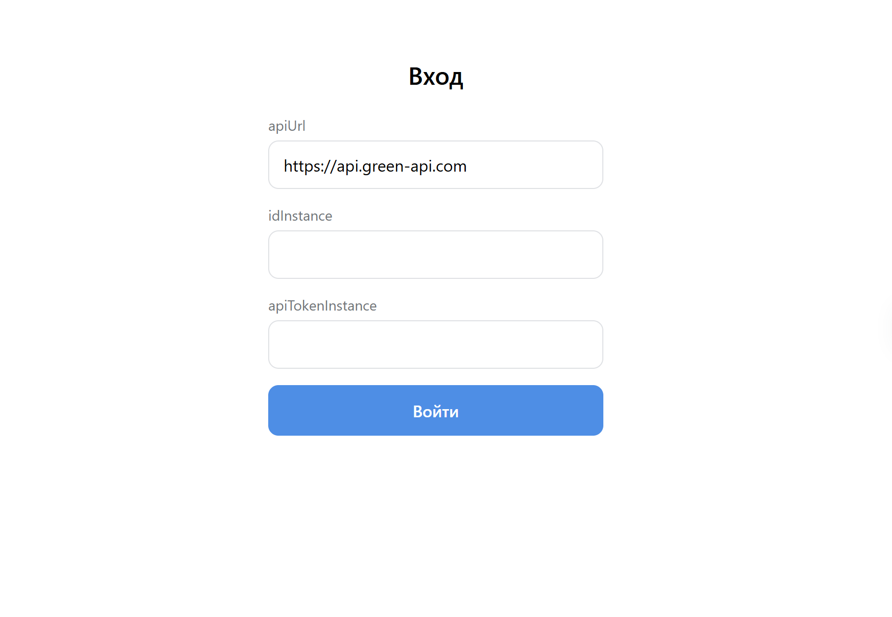
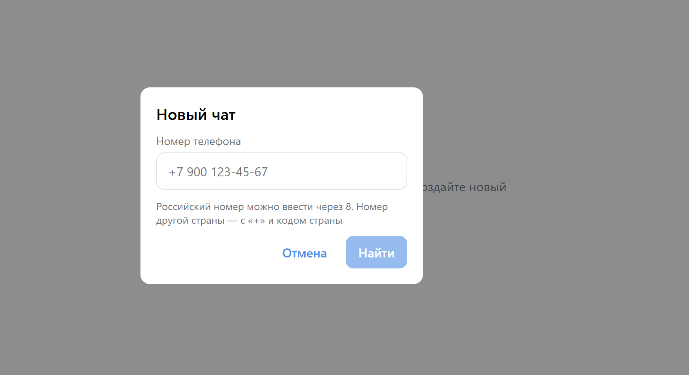
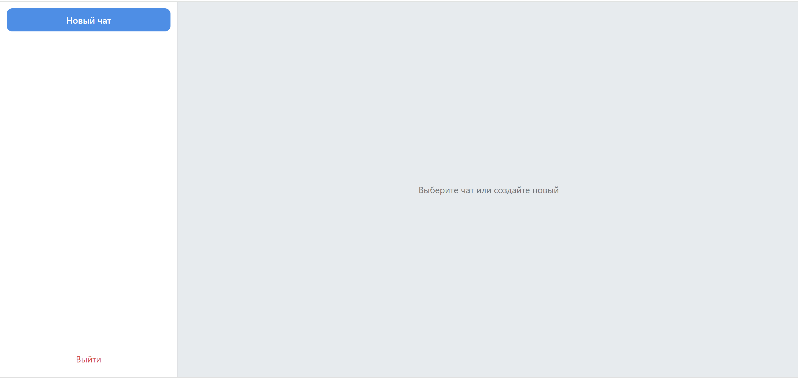
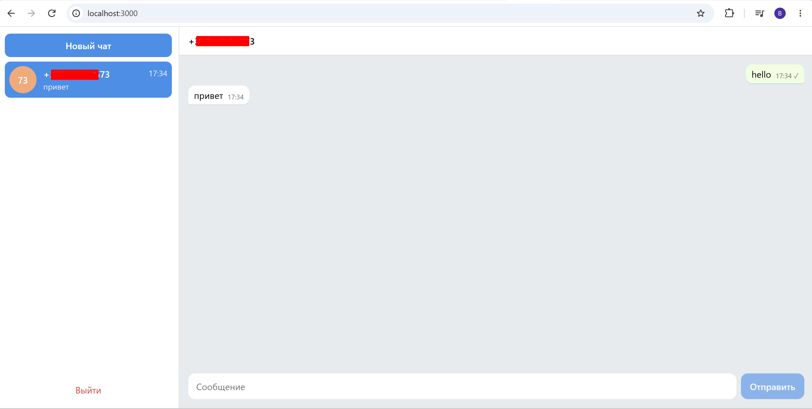

# Telegram Chat на GREEN-API

Веб-интерфейс для отправки и получения текстовых сообщений Telegram через
сервис [GREEN-API](https://green-api.com/telegram/). Внешний вид — в
стиле [web.telegram.org](https://web.telegram.org/).

**Демо:** https://mirego2013.github.io/telegram-green-api-chat/

## Возможности

- Вход по учётным данным инстанса GREEN-API (`apiUrl`, `idInstance`, `apiTokenInstance`) с проверкой статуса инстанса.
- Создание чата по номеру телефона: номер проверяется через `checkAccount`, у кого нет Telegram — понятная ошибка.
- Отправка текстовых сообщений: сообщение сразу появляется в ленте, статус меняется на ✓ после ответа сервера или на ⚠
  при ошибке.
- Получение входящих сообщений в реальном времени (long polling очереди уведомлений). Сообщение от нового собеседника
  само создаёт чат.
- История чатов и учётные данные сохраняются в браузере: после перезагрузки и повторного входа всё на месте. У каждого
  инстанса своя история.
- Адаптивная вёрстка: на узком экране — либо список чатов, либо открытый чат с кнопкой «назад».

## Стек

- **React 19** + **TypeScript 7** + **Vite 8**
- Состояние — `useReducer` + Context, без сторонних библиотек
- Стили — CSS Modules и CSS-переменные палитры Telegram
- Запросы — `fetch`
- Линтер — [Oxlint](https://oxc.rs/docs/guide/usage/linter), форматирование — [Prettier](https://prettier.io/)

## Запуск

Нужен **Node.js 20.19+ или 22.12+**.

```bash
npm install
npm run dev
```

Приложение откроется на http://localhost:3000.

| Команда           | Что делает                                                 |
|-------------------|------------------------------------------------------------|
| `npm run dev`     | dev-сервер с проверкой типов в терминале                   |
| `npm run build`   | проверка типов, линтер и сборка в `dist/`                  |
| `npm run preview` | локальный просмотр собранной версии                        |
| `npm run lint`    | проверка кода Oxlint (`lint:fix` — безопасные исправления) |
| `npm run format`  | форматирование Prettier (`format:check` — только проверка) |

## Подготовка инстанса GREEN-API

1. Зарегистрируйтесь в [личном кабинете](https://console.green-api.com/) и создайте инстанс **Telegram**.
2. Авторизуйте инстанс: в Telegram на телефоне **Настройки → Устройства → Подключить устройство** и отсканируйте QR-код
   из карточки инстанса.
3. **Включите уведомления о входящих сообщениях.** В настройках инстанса включите «Получать уведомления о входящих
   сообщениях и файлах» (`incomingWebhook`). После создания инстанса она выключена, и без неё ответы собеседников **не
   будут приходить** в чат. Изменения настроек применяются в течение 5 минут.
4. Поле **`webhookUrl` должно быть пустым** — иначе уведомления уходят на этот адрес, а не в очередь, которую читает
   приложение.
5. Скопируйте из карточки инстанса `apiUrl`, `idInstance` и `apiTokenInstance` — они понадобятся для входа.

Проверить настройки можно в консоли браузера на открытой странице приложения после входа:

```js
const c = JSON.parse(localStorage.getItem('greenApiCredentials'))
const s = await (
    await fetch(
        `${c.apiUrl}/waInstance${c.idInstance}/getSettings/${c.apiTokenInstance}`,
    )
).json()
console.log({incomingWebhook: s.incomingWebhook, webhookUrl: s.webhookUrl})
// ожидается { incomingWebhook: 'yes', webhookUrl: '' }
```

> **Безопасность аккаунта.** Подключение инстанса по QR — полноценный вход в Telegram: сервис получает доступ ко всем
> обычным чатам и может отправлять сообщения от имени аккаунта. Для проверки лучше использовать отдельный аккаунт
> Telegram, а основной — как второго собеседника. После проверки сессию можно завершить в **Настройки → Устройства**.

## Как пользоваться

1. **Вход.** Введите `apiUrl`, `idInstance` и `apiTokenInstance`. Пробелы по краям и слэш в конце адреса убираются
   автоматически, протокол `https://` подставляется, если его нет. Пускает, только если инстанс в статусе `authorized`.
2. **Новый чат.** Кнопка «Новый чат» → номер телефона собеседника. Российский мобильный можно ввести через 8
   (`8 900 123-45-67`), номер другой страны — с `+` и кодом страны (`+84 912 345 678`).
3. **Отправка.** Enter — отправить, Shift+Enter — новая строка. Длина сообщения — до 4096 символов (ограничение API).
4. **Получение.** Ответы собеседников появляются в течение нескольких секунд. Сообщение от человека, которого нет в
   списке, создаёт новый чат, но не переключает открытый.
5. **Выход.** Кнопка «Выйти» внизу списка чатов. Учётные данные удаляются, история чатов остаётся и вернётся при
   следующем входе в тот же инстанс.

## Скриншоты

| Вход                                     | Новый чат                                          |
|------------------------------------------|----------------------------------------------------|
|  |  |


